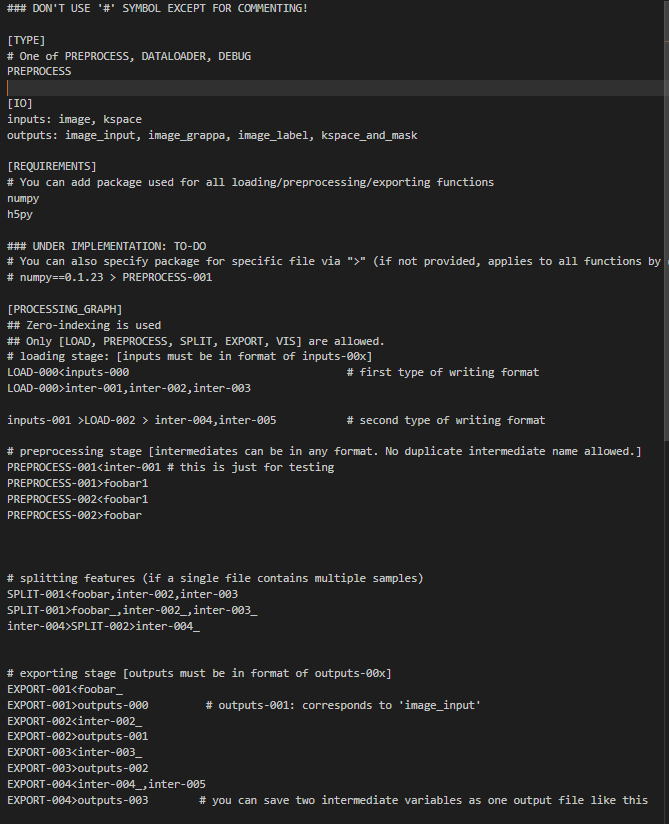
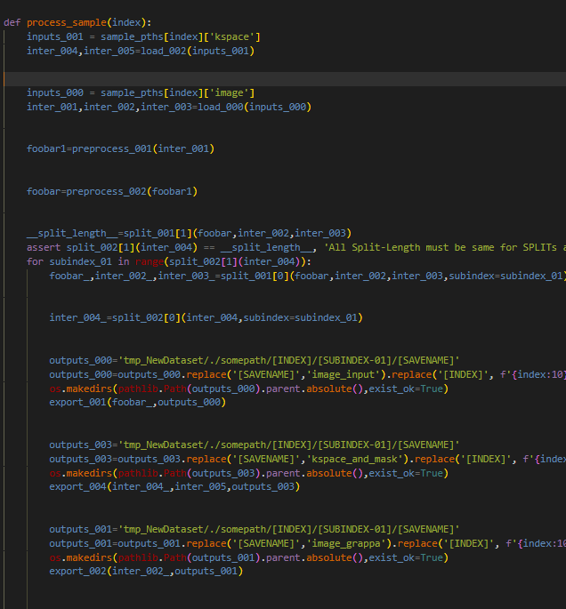

First, create  a config file with PREPROCESS-001.py files under the .round folder of directory like this.

ROUND's scriptwriters will automatically write down the preprocess code for you like this.