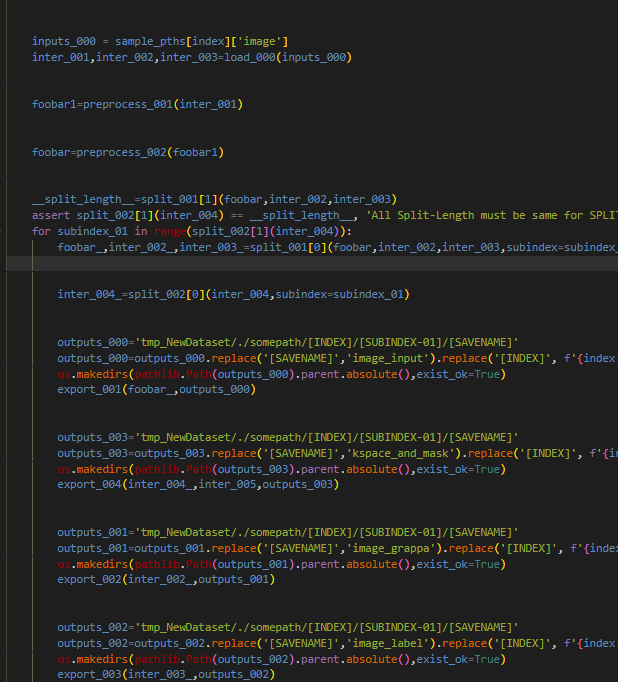

By team ROUND https://round-ai.github.io/
<h3>Goals</h3>

We aim to help researchers and developers can maximize the usage of AI datasets and exploit most out of them. ROUND is an open-source data preparation service that helps create preprocess pipelines and visualize intermediate outputs very easily.

<h3>News</h3>

- **2024.08.04** Initial release!
- **(ETA) 2024.08.10** GUI features will be released!

<h3>Installation</h3>

To install, use `pip install -e .`

<h3>How to Use</h3>

First, create  a config file with PREPROCESS-001.py files under the .round folder of directory like this.

ROUND's scriptwriters will automatically write down the preprocess code for you like this.