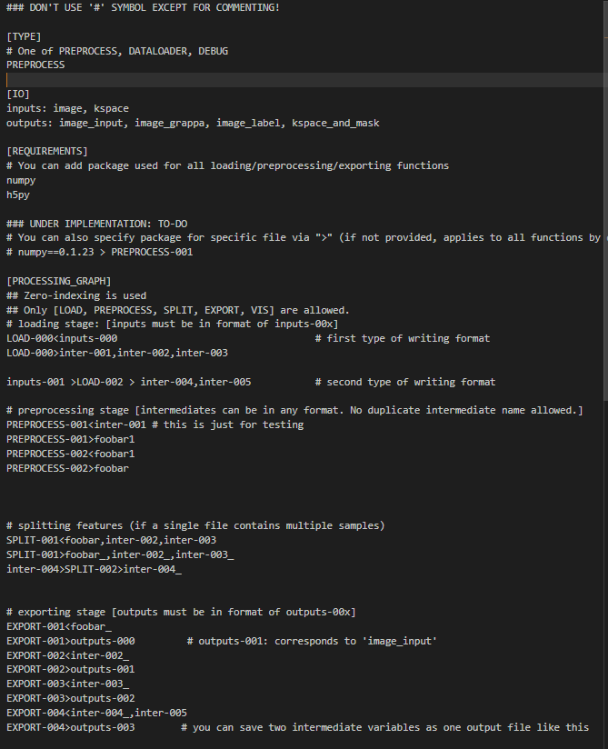

By team ROUND https://round-ai.github.io/
<h3>Goals</h3>

We aim to help researchers and developers can maximize the usage of AI datasets and exploit most out of them. ROUND is an open-source data preparation service that helps create preprocess pipelines and visualize intermediate outputs very easily.

<h3>News</h3>

- **2024.08.04** Initial release!
- **(ETA) 2024.08.10** GUI features will be released!

<h1>WORK IN PROGRESS</h1>

<h3>Installation</h3>

To install, use `pip install -e .`

<h3>How to Use</h3>


Say you have your own dataset under some `dataset directory="./Dataset"`, you can first analyze the dataset
using following code.

```python
import round
round.analyze_dataset(dataset_pth="./Dataset")
```

Then, create a config file using the GUI we provide (Coming Soon!),

or manually like below.



You should create `LOAD-00x.py, SPLIT-00x.py, PREPROCESS-00x.py, VIS-00x.py` and specify their path in the config file.


Put the config file under `./Dataset/.round/configs`, and run the following command to preprocess and save the dataset.
```python
import round
round.preprocess_dataset(dataset_pth="./Dataset", save_dataset_pth="./Preprocessed_Dataset", config_name="{some config name}")
```

or for creating dataloaders
```python
import round
dataloader = round.prepare_dataloader(dataset_pth="./Dataset", config_name="{some config name}")
```